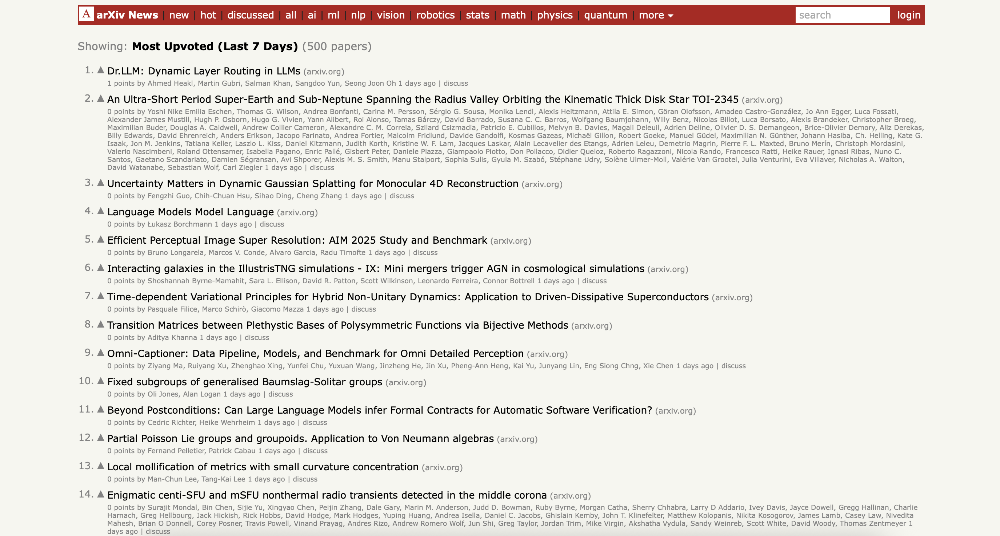

# 📰 arXiv News



A Hacker News-style platform for discovering and discussing research papers from arXiv.


**🌐 Live:** [arxiv-news.com](https://arxiv-news.com)

## Features

- **Daily Feed** - 500+ papers scraped daily from arXiv
- **Voting & Comments** - Upvote and discuss papers
- **Smart Sorting** - Hot, New, or Most Discussed
- **Category Filtering** - Browse by AI, ML, Physics, Math, and more
- **Search** - Find papers by title, abstract, or author

## Updates Coming Soon

- 👤 **User Accounts** - Save your profile and activity
- 👥 **Communities** - Create topic-based discussion groups
- **Any ideas?**

## Tech Stack

**Frontend:** React, Vite, Vercel  
**Backend:** FastAPI, PostgreSQL, Railway  
**Scraper:** Daily cron job on Railway

## Local Development

```bash
# Backend
cd backend
pip install -r requirements.txt
uvicorn main:app --reload
python scraper.py  # Initial data

# Frontend
cd frontend
npm install
npm run dev
```

## License

MIT - Use freely!

---

Made for the research community 🔬
